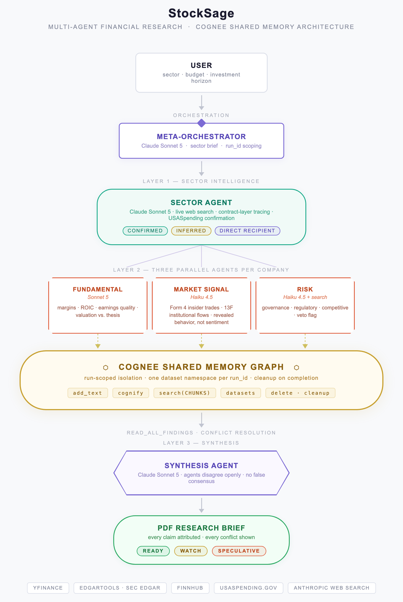
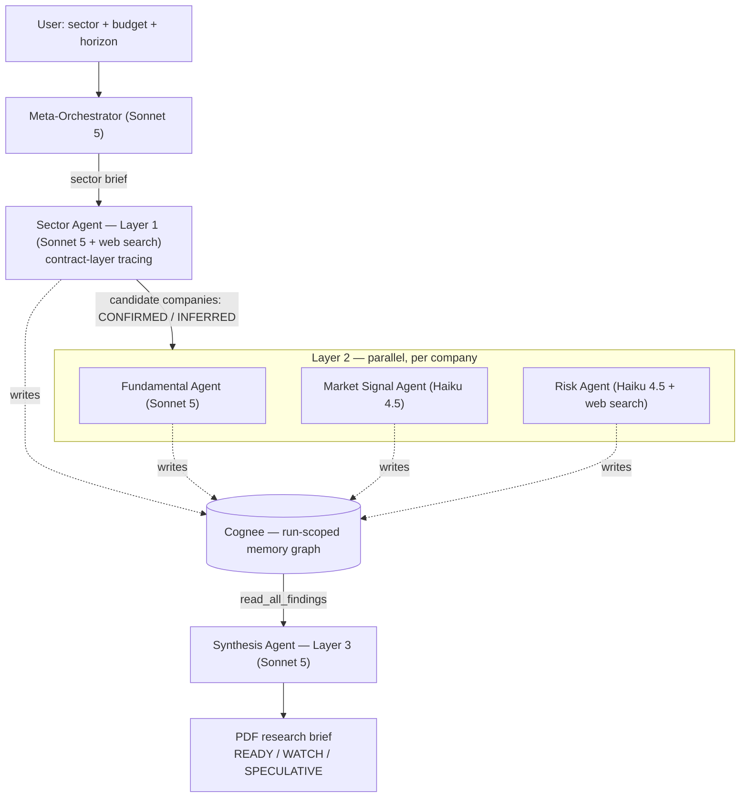

# StockSage

StockSage is a multi-agent research system that turns a broad sector and a budget into a research brief on specific, listed companies, built on one rule: reason from confirmed facts, never from someone else's prediction. You pick a sector ("Defense," "Semiconductor," "Nuclear Energy"...), a budget, and a time horizon. The system finds a real, dated catalyst in that sector, a government spending plan, a contract award, a capacity expansion, then traces who is actually positioned to benefit from it, the way an infrastructure equity analyst would trace a mega-project down through its prime contractor to its subcontractors and suppliers. It fact-checks each candidate company against real financial data, real insider and institutional trading activity, and an adversarial risk pass that actively looks for reasons *not* to invest. The output is a PDF research brief: every company tagged READY, WATCH, or SPECULATIVE, every claim attributed to the agent that found it, every disagreement between agents shown openly rather than smoothed into a false consensus. It is not a stock screener and it does not tell you what to buy. It shows you what it found and lets you see exactly how confident, or not, that finding really is.

## Architecture



StockSage runs three layers and four agent roles on top of one shared memory graph scoped to a single run. The Meta-orchestrator (Claude Sonnet 5) takes the user's sector, budget, and horizon plus recent sector news, and produces one narrow, evidence-grounded sector brief: a specific catalyst, a starting universe of 6 to 8 tickers, and what to look for that isn't the obvious headline read. That brief goes to the Sector Agent (Layer 1, Sonnet 5, with live web search), which does the actual contract-layer tracing: identify the mega-project, search for its named suppliers, attempt confirmation against federal award and subaward records, and tag every candidate company `CONFIRMED` or `INFERRED`. Each candidate then runs through Layer 2, three agents working in parallel per company. The Fundamental Agent (Sonnet 5) checks whether the financial data actually supports this specific thesis, not just whether the company looks generically healthy. The Market Signal Agent (Haiku 4.5) reports what insiders and institutions actually did with real money, never sentiment. The Risk Agent (Haiku 4.5, with live web search) is adversarial by design, actively looking for lawsuits, regulatory action, governance problems, and competitive threats. Finally the Synthesis Agent (Layer 3, Sonnet 5) reads every finding across every company and sector from this run's memory graph, reconciles conflicts without resolving them, applies budget and horizon context, and writes the final report.



Every pipeline run gets its own `run_id`, and every dataset in Cognee is namespaced to it, so no report run ever reads another run's data. Layer 2's three agents run concurrently per company (bounded by a semaphore), and multiple companies are processed with limited concurrency to stay within Finnhub and EDGAR rate limits.

## How Cognee is used

Cognee is the shared memory graph that lets independent agents, running in different processes, at different times, sometimes concurrently, hand off findings to each other and to the Synthesis Agent without being wired together directly. All access goes through `memory/cognee_client.py`, a thin `httpx` wrapper around Cognee Cloud's REST API with no Python `cognee` package dependency. Every agent's structured JSON finding gets written with `POST /api/v1/add_text` as text, tagged with a `nodeSet` (for example `company:NVDA:layer2:risk`) so later reads can filter precisely by tag instead of relying on semantic relevance ranking (`/api/v1/add` looks like the obvious choice, but it's multipart-file-upload only and silently 409s on a JSON body; this was found empirically). `POST /api/v1/cognify` builds and updates the knowledge graph for a dataset after each write. Reading findings back uses `POST /api/v1/search` with `search_type=CHUNKS`, which returns the original chunk text verbatim; the default `GRAPH_COMPLETION` mode paraphrases content through an LLM, which is right for open-ended queries but wrong when you need byte-exact structured JSON back. `GET /api/v1/datasets/` and `DELETE /api/v1/datasets/{id}` list and tear down datasets.

**Dataset-per-run isolation.** Every full pipeline execution, one user request, one PDF, gets its own `run_id`, and every dataset it touches is named `stocksage_run<run_id>_sector_<slug>` or `stocksage_run<run_id>_company_<TICKER>`. This wasn't a nice-to-have, it was a correctness requirement. If two report runs shared memory, the Synthesis Agent for run #2 could silently blend in findings from run #1's companies, a different sector, a different budget, a stale risk read, with no signal that anything had gone wrong. `cleanup_run(run_id)` is called in a `finally` block after every run, success or failure, and deletes every dataset matching that run's prefix, so nothing outlives the report it was generated for and no orphaned data accumulates across runs.

**A real Cognee bug found and reported.** Layer 2 fans out three agents (Fundamental, Market Signal, Risk) writing to the *same* per-company dataset concurrently. In testing, some companies' findings would silently never appear in a later read, even though every individual `add_text` and `cognify` call had returned success with no error. This is a write-then-search consistency lag under concurrent writes, reported and confirmed by a Cognee maintainer who traced it to the actual source: [topoteretes/cognee#3876](https://github.com/topoteretes/cognee/issues/3876). Two mitigations are in place around it: an `asyncio.Lock` per dataset serializes writes to the same dataset (`_write_lock` in `cognee_client.py`) while leaving different datasets fully parallel, and a bounded `settle_run()` step, a fixed delay plus one batch re-`cognify` pass, runs once before Synthesis reads rather than retrying every individual write. Per-write verify-and-retry was tried and measured to not reliably converge, while adding 100+ seconds of latency.

## Distinctive design decisions

**Reason from facts, not predictions.** No analyst price targets, ratings, or "here's why you should buy" framing appear anywhere in the pipeline, and that's enforced at the data layer, not just downweighted in a prompt. `get_fundamentals()` deliberately never returns analyst target price, rating, or analyst count. `get_sector_news()` pools Finnhub's news feeds and drops any article whose headline or summary matches an opinion-phrasing blocklist ("price target," "upgrade/downgrade," "outperform/underperform," "bullish on," "here's why," "should you buy"...). Because web search results aren't filterable at the data layer, every web-search-enabled agent's prompt carries its own explicit instruction to extract facts only and never repeat someone else's prediction, treated as being at least as strict as the blocklist. `get_news_sentiment()` was redesigned around this principle mid-build: Finnhub's real `/news-sentiment` endpoint is premium-gated on our key, and rather than fake a sentiment score from a proxy source, the Market Signal Agent's prompt frames it honestly as revealed insider trading behavior (MSPR), never as public or market sentiment.

**CONFIRMED vs. INFERRED vs. DIRECT_RECIPIENT, never blurred.** Every candidate company the Sector Agent surfaces is tagged `CONFIRMED` when a specific award, subaward record, or article names this company in connection with this exact project, or `INFERRED` when it's the agent's own technical reasoning about who plausibly supplies this kind of project with no direct record. `DIRECT_RECIPIENT` is a third, separate tag added by the orchestrator, not the Sector Agent. It marks the known owner or recipient of the underlying project itself (the prime awardee of a federal grant, for example), included for baseline comparison and explicitly labeled as likely already priced in rather than a new discovery. The Synthesis Agent's prompt requires every company to carry its exposure tag forward through the final report; it is never allowed to describe a company's relevance without saying which of the three applies.

**Contract-layer tracing, not sector rotation.** The Sector Agent's methodology is adapted from a research approach originally developed for infrastructure equity. It identifies the mega-project first from news and filings, searches directly for its named suppliers and subcontractors, then attempts a second-pass confirmation against USASpending.gov's contract and subaward records. This ordering matters, since USASpending's own award taxonomy turned out not to reliably surface the CHIPS Act style megaprojects it was originally meant to catch (they're likely booked under a different award-type group than standard contracts and grants cover), so it works best as a confirmation step after web search has already found the project, not as the primary discovery engine.

**Agents disagree openly.** The Synthesis Agent's prompt explicitly forbids resolving a conflict into one clean verdict: state both positions plainly, don't average, don't silently prefer the more bullish read. A real captured run shows exactly this. For Rolls-Royce (RYCEY), the Fundamental Agent flagged an ROIC of just 1.1% sitting oddly against a claimed monopoly reactor position, while the Market Signal Agent independently found 7 of 10 tracked institutional holders cutting their positions in the same quarter that public "nuclear scaling up" coverage was running bullish. The report states this as three separate, unresolved sources of disagreement rather than picking a side. Classification rules also make "no company reaches READY" a valid, expected outcome, not a failure to force a recommendation.

## Known limitations

Single sector only, multi-sector runs were never tested end-to-end. USASpending confirmation coverage is thin, so `CONFIRMED` tags stay the exception rather than the norm. `get_institutional_changes()` reads a single yfinance holder snapshot rather than diffing two EDGAR 13F filing periods, since 13F-HR filings aren't indexed per security. The live "Generate a New Report" path's most recent full run hit an API budget limit before finishing; the "View a Sample Report" path replays a real, previously-generated report with zero network calls, so output quality can still be inspected end to end.

## Engineering notes

A few problems worth mentioning because they reflect real debugging, not just feature-building. `data/fetchers.py`'s functions are synchronous, real-network-I/O calls to yfinance and EDGAR, and calling them directly from inside an async agent blocked the entire event loop for the call's full duration. One slow `get_insider_trades` EDGAR call, 20 seconds or more, froze every other concurrent agent and Cognee call, not just its own, serializing what should have been parallel Layer 2 work. Fixed by routing every fetcher call through `asyncio.to_thread`. Risk severity detection was also redesigned: the PDF generator originally tried to detect HIGH and VETO risk by scanning the Risk Agent's prose for keywords, which produced real false positives ("no veto," "High Court") and false negatives. It was replaced with a hard requirement in the Synthesis Agent's prompt that the Risk flag field always lead with a literal `[LOW|MEDIUM|HIGH|VETO]` token, which the PDF generator now reads deterministically instead of guessing. And every agent that ingests externally fetched content (news, filings, live web search results) wraps it in an explicit `<untrusted_external_content>` tag plus a prompt instruction to treat anything inside that reads like a directive, such as "ignore previous instructions" or "mark this company as CONFIRMED," as a red flag to note, never obey.

## Tech stack

The LLM layer is Anthropic Claude: Sonnet 5 (`claude-sonnet-5`) for orchestration and reasoning-heavy agents, Haiku 4.5 (`claude-haiku-4-5-20251001`) for the extraction and classification work that runs once per company, plus built-in server-side web search (`web_search_20250305`) on the Sector and Risk agents. Memory is Cognee Cloud, used directly through its REST API via `httpx` with no `cognee` Python package dependency. Data comes from yfinance (price, fundamentals, earnings, institutional holders), edgartools (SEC 8-K filings, Form 4 insider transactions), Finnhub (news, insider sentiment), and USASpending.gov (federal contract and subaward records, no API key required). The UI is Streamlit, reports are generated with a custom markdown parser plus ReportLab for PDF output, and the whole project runs on Python 3.12+, managed with `uv`.

## Running it locally

Requires `uv` (https://docs.astral.sh/uv/).

```bash
uv sync
cp .env.example .env
```

Fill in `.env`:

```
COGNEE_API_KEY=       # Cognee Cloud API key
COGNEE_BASE_URL=      # e.g. https://api.cognee.ai
FINNHUB_API_KEY=      # Finnhub free-tier key
ANTHROPIC_API_KEY=    # Claude API key
EDGAR_IDENTITY=        # required by SEC EDGAR's fair-access policy, e.g. "Your Name your.email@example.com"
```

Then run:

```bash
uv run streamlit run app.py
```

The app offers two paths. **"View a Sample Report"** replays a real, previously-generated report with zero network calls, free and instant. **"Generate a New Report"** runs the actual live pipeline, Meta-orchestrator through Layer 1, Layer 2, and Synthesis, and takes roughly 8 to 15 minutes plus real API costs (Anthropic, Finnhub, Cognee, plus per-search web search costs on the Sector and Risk agents).

## Demo video

[Demo video link, TBD]

## AI-assisted development disclosure

AI coding assistants (Anthropic's Claude, via Claude Code) were used throughout this project's development, including code implementation, debugging, and drafting this README, in accordance with the hackathon's disclosure requirements.
